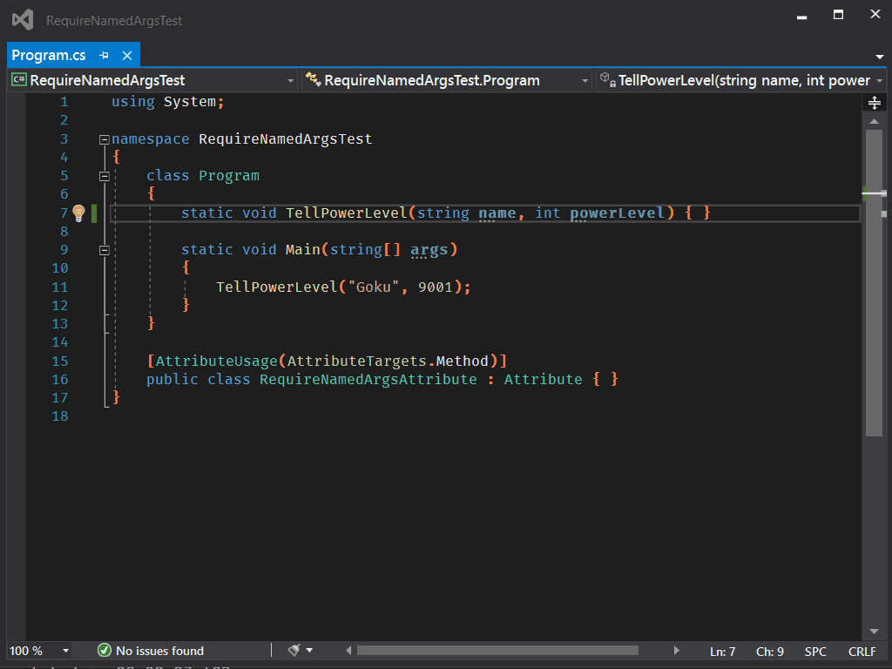

# Require a method to be invoked with named arguments

## Motivation
### 1. There seems to be a certain level of interest in having a way to [force named arguments in C#](https://stackoverflow.com/questions/11300645/forcing-named-arguments-in-c-sharp)

### 2. Say, you're using [a builder to create test data to improve your tests](https://ardalis.com/improve-tests-with-the-builder-pattern-for-test-data)

In simpler cases, it's possible to reduce code repetition if you can require named parameters.  
For example, let's take a code snippet from the [blog post](https://ardalis.com/improve-tests-with-the-builder-pattern-for-test-data) and simplify it:

Here's the original code:
```csharp
public class AddressDTOBuilder
{
    private AddressDTO _entity = new Address;
    public AddressBuilder Id(int id)
    {
        _entity.Id = id;
        return this;
    }

    public AddressBuilder Line1(string line1)
    {
        _entity.Line1 = line1;
        return this;
    }

    // some methods omitted

    public AddressBuilder AttentionTo(string attn)
    {
        _entity.AttentionTo = attn;
        return this;
    }

    // more methods omitted

    public AddressDTO Build()
    {
        return _entity;
    }

    // This approach allows easy modification of test values
    // Another approach would just have a static method returning AddressDTO
    public AddressBuilder WithTestValues()
    {
        _entity = new AddressDTO
        {
            Line1 = "12345 Test Street",
            Line2 = "3rd Floor",
            Line3 = "Suite 300",
            AttentionTo = "Test Person",
            City = "Test City",
            State = "OH",
            ZipCode = "43210",
            Country = "US",
            Description = "Test Description",
            Id = Constants.TEST_ADDRESS_ID
        }
    }
}
```

And a simplified version:
```csharp
public class TestAddressDTOBuilder
{
    [RequireNamedArgs]
    public AddressDTO BuildWith(
        string line1 = null,
        string line2 = null,
        string line3 = null,
        string attentionTo = null,
        string city = null,
        string state = null,
        string zipCode = null,
        string country = null,
        string description = null,
        Guid? id = null)
    {
        var addressDto = new AddressDTO
        {
            Line1 = line1 ?? "12345 Test Street",
            Line2 = line2 ?? "3rd Floor",
            Line3 = line3 ?? "Suite 300",
            AttentionTo = attentionTo ?? "Test Person",
            City = city ?? "Test City",
            State = state ?? "OH",
            ZipCode = zipCode ?? "43210",
            Country = country ?? "US",
            Description = description ?? "Test Description",
            Id = id ?? Constants.TEST_ADDRESS_ID
        };

        return addressDto;
    }
}
```

Using the `[RequireNamedArgs]` attribute in the above code sample is important as it makes sure a call to `BuildWith` uses named arguments.

So something like this is OK:
```csharp
var testAddressDtoBuilder = new TestAddressDTOBuilder();
// some code skipped...
var addresDto = testAddressDtoBuilder.BuildWith(line3: "Suite 500", state: "WA");
```

But the analyzer will not allow the code sample below to compile:
```csharp
var testAddressDtoBuilder = new TestAddressDTOBuilder();
// some code skipped...
var addresDto = testAddressDtoBuilder.BuildWith("54321 Another test street", "9th Floor");

```

## Download and install

Install the [RequireNamedArgs](https://www.nuget.org/packages/RequireNamedArgs) nuget package.
For example, run the following command in the [NuGet Package Manager Console](https://docs.microsoft.com/en-us/nuget/tools/package-manager-console).

```powershell
Install-Package RequireNamedArgs
```
   
This will download all the binaries, and add necessary analyzer references to your project.

## How to use it?

1. Install the nuget package.
2. Introduce `RequireNamedArgsAttribute` attribute to your solution.  
   I. e., create your own  
   ```csharp
   [AttributeUsage(AttributeTargets.Method)]
   public class RequireNamedArgsAttribute : Attribute { }
   ```
3. Mark methods which should only be invoked with named arguments with a `[RequireNamedArgs]` attribute.   

For example:
```csharp
[RequireNamedArgs]
public static void TellPowerLevel(string name, int powerLevel) {}

// Elsewhere in your code:
// if `TellPowerLevel` method is called with positional arguments,
// the analyzer will emit an error.
TellPowerLevel(name: "Goku", powerLevel: 9001);
```

## How does it work?

1. This analyzer looks at an invocation expression (e.g., a method call).
2. It then finds the method's definition.
3. If the definition is marked with a `[RequireNamedArgs]` attribute,  
   the analyzer requires to every caller to provide names for the invocation's arguments.
4. If the last parameter is `params`, the analyzer  
   doesn't emit the diagnostic, as we cannot use named arguments in this case.



## Technical details

The analyzer, code-fix provider, and tests are implemented in F#

# Thank you!

- [John Koerner](https://github.com/johnkoerner) for [Creating a Code Analyzer using F#](https://johnkoerner.com/code-analysis/creating-a-code-analyzer-using-f/)
- [Dustin Campbell](https://github.com/DustinCampbell) for [CSharpEssentials](https://github.com/DustinCampbell/CSharpEssentials)
- [Alireza Habibi](https://github.com/alrz) for [CSharpUseNamedArgumentsCodeRefactoringProvider](https://github.com/dotnet/roslyn/blob/master/src/Features/CSharp/Portable/UseNamedArguments/CSharpUseNamedArgumentsCodeRefactoringProvider.cs) which provided very useful code examples.
- [Steve Smith](https://ardalis.com/) for his article [Improve Tests with the Builder Pattern for Test Data](https://ardalis.com/improve-tests-with-the-builder-pattern-for-test-data).

# License

The [RequireNamedArgs](https://github.com/mykolav/require-named-args-fs) analyzer and code-fix provider are licensed under the MIT license.  
So they can be used freely in commercial applications.
